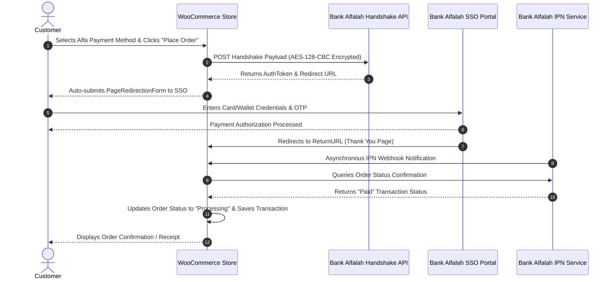

# AlfaPay Connect for WooCommerce (Fixed & Hardened Edition)

[](https://wordpress.org)
[](https://woocommerce.com)
[](https://www.php.net)
[](https://woocommerce.com/document/high-performance-order-storage/)
[](https://github.com/amanullahykhan)
[](LICENSE)

An enterprise-grade, secure, and modernized **Bank Alfalah Alfa Payment Gateway** integration plugin for **WooCommerce**. This customized and hardened edition resolves critical legacy vulnerabilities, fixes modern hosting timeouts (including Hostinger / OpenSSL 3 cURL EOF bugs), implements full High-Performance Order Storage (HPOS) compatibility, and provides multi-channel payment support for Pakistani merchants.

---

## 📑 Table of Contents

- [Overview](#-overview)
- [Key Features](#-key-features)
- [Supported Payment Channels](#-supported-payment-channels)
- [Comprehensive Fixes & Security Hardening](#-comprehensive-fixes--security-hardening)
- [Architecture & Transaction Flow](#-architecture--transaction-flow)
- [Requirements](#-requirements)
- [Installation Guide](#-installation-guide)
- [Configuration & Settings](#-configuration--settings)
- [Sandbox & Live Testing](#-sandbox--live-testing)
- [Troubleshooting & FAQs](#-troubleshooting--faqs)
- [👤 Author & Developer](#-author--developer)
- [License](#-license)

---

## 🌟 Overview

The **Alfa Payment Gateway** connects your WooCommerce store directly to the **Bank Alfalah Alfa Online Payment System (Pakistan)**. It allows e-commerce stores to accept seamless, digital payments with instant authorization and automated order status reconciliation.

While the original legacy integration suffered from frequent cURL handshake failures on modern PHP/OpenSSL stacks, security gaps in webhook handling, and admin script pollution, this **fixed edition** has been completely refactored and hardened for rock-solid production reliability.

---

## ✨ Key Features

- **Seamless Redirection-Based Checkout**: Directs customers to Bank Alfalah's secure Single Sign-On (SSO) checkout page for encrypted payment completion.
- **Multi-Channel Payment Methods**: Accept Credit/Debit Cards, Alfa Wallets, Bank Alfalah Accounts, BNPL Islamic, Card on Delivery, and JazzCash from a single gateway.
- **OpenSSL 3.x & PHP 8+ Resilience**: Built-in automatic Streams transport fallback and retry mechanism to completely eliminate `cURL error 56: SSL_read: unexpected eof` issues.
- **Security-First Architecture**: Prevents SSRF attacks on IPN listener, eliminates unauthenticated AJAX execution, verifies order key hashes, and strictly maintains TLS certificate verification.
- **High-Performance Order Storage (HPOS) Ready**: Uses native WooCommerce CRUD methods (`wc_get_order()`, `$order->get_meta()`) ensuring compatibility with modern WooCommerce order storage.
- **Admin Test Connection Tool**: Real-time diagnostic button in WooCommerce Settings to verify credentials against Bank Alfalah's handshake API instantly.
- **Comprehensive Logging**: Automatically logs errors, failed handshakes, and IPN payloads to `WooCommerce > Status > Logs` (`bank-alfalah`), making debugging transparent.
- **Isolated Admin Assets**: Enqueues CSS and JavaScript strictly within the gateway settings tab, preserving admin dashboard performance.
- **Mutually Exclusive Radio Controls**: Client-side logic prevents conflicts between Alfa sub-channels and other WooCommerce gateways (such as Cash on Delivery or BACS).

---

## 💳 Supported Payment Channels

Merchants can enable or disable any of the following payment channels from the WooCommerce gateway settings:

| Payment Channel | Identifier | Description |
| :--- | :---: | :--- |
| **Credit / Debit Card** | `3` | Accepts Visa & MasterCard cards globally. |
| **Alfa Digital Wallet** | `1` | Direct payment from registered Bank Alfalah Alfa Mobile Wallets. |
| **Bank Alfalah Account** | `2` | Direct debit from Bank Alfalah bank accounts. |
| **Alfa BNPL Islamic** | `5` | Buy-Now-Pay-Later Shariah-compliant installment facility. |
| **Card On Delivery** | `6` | Post-dated card charge on physical delivery. |
| **JazzCash Wallet** | `11` | Instant mobile wallet checkout via JazzCash. |

---

## 🛠️ Comprehensive Fixes & Security Hardening

This edition incorporates extensive architectural, performance, and security enhancements developed and maintained by **Amanullah Khan**:

### 1. 🔒 Security & Vulnerability Resolutions
- **Eliminated SSRF & Order Spoofing in IPN Listener (`check_ipn_response`)**:
  - *Previous Risk*: Accepted arbitrary client-supplied callback URLs and query strings, opening potential Server-Side Request Forgery (SSRF) and fake "Paid" status injection.
  - *Fix Applied*: Strictly sanitizes `order_id` as an absolute integer (`absint()`), verifies order ownership against the gateway ID (`BAF_WOO_GATEWAY_ID`), and constructs the IPN endpoint internally with merchant credentials.
- **Secured Admin Test Connection (`bank_alfalah_AuthToken`)**:
  - *Previous Risk*: Allowed unauthorized or unauthenticated execution via missing capability checks and insecure `wp_ajax_nopriv_*` hooks.
  - *Fix Applied*: Restricted endpoint strictly to administrators with `manage_woocommerce` capability, added cryptographic nonce verification (`check_ajax_referer('bank_alfalah_test_connection', 'nonce')`), and removed public execution hooks.
- **Timing-Safe Order Key Verification on Thank-You Page**:
  - *Fix Applied*: Utilizes `hash_equals($order->get_order_key(), $submitted_key)` to ensure order status updates are triggered only by legitimate customer sessions.
- **Strict TLS/SSL Verification (`sslverify => true`)**:
  - *Fix Applied*: Retains strict TLS certificate verification on all bank communications, preventing credential interception and Man-in-the-Middle (MitM) exploits.

### 2. ⚡ Network & API Compatibility Fixes (OpenSSL 3 & cURL 56)
- **OpenSSL 3.x / cURL 56 EOF Bug Mitigation**:
  - *Problem*: Shared and managed hosting environments (such as Hostinger, cPanel, SiteGround) running PHP 8.1+ with OpenSSL 3.x experienced frequent handshake connection termination (`error:0A000126`).
  - *Solution*: Added a dynamic transport filter (`http_api_transports`) to force PHP Streams transport and implemented an automatic single-retry fallback on transient SSL teardowns.
- **Replaced Deprecated `file_get_contents()`**:
  - *Solution*: Standardized all API calls on the WordPress HTTP API (`wp_remote_get()` / `wp_remote_post()`), bypassing host `allow_url_fopen` restrictions and providing granular timeout control (45s).
- **Double-Encoded JSON Handling**:
  - *Solution*: Added recursive JSON decoding for IPN payloads returned as double-encoded strings from the bank's API.

### 3. 🎯 Handshake & SSO Payload Standardization
- **Exact MapString & DOM Ordering**:
  - Standardized the order of fields in the AES-128-CBC encryption payload to match Bank Alfalah's strict validation specification (`HS_RequestHash` calculated with empty placeholder before encryption).
- **Sanitized Return URLs**:
  - Ensured that return URLs sent to Bank Alfalah remain clean and free from excess query strings that break bank hash validation.

### 4. 🚀 WooCommerce Modernization & UI Optimization
- **Full HPOS Compatibility**: Converted legacy post-meta database queries to standard WooCommerce CRUD operations (`$order->update_meta_data()`, `$order->save()`).
- **Clean Admin Query Parsing**: Replaced fragile `REQUEST_URI` string splitting with safe `$_GET['section']` checks, fixing broken admin screens when query parameters like `&from=WCADMIN_PAYMENT_SETTINGS` are appended.
- **Admin Resource Isolation**: Gateway JavaScript and CSS are loaded strictly on the gateway configuration screen instead of cluttering every WordPress administrative screen.
- **Centralized Logging Framework**: Added `bank_alfalah_log()` for error tracing in `WooCommerce > Status > Logs`.

---

## 🏛️ Architecture & Transaction Flow

The sequence below illustrates the communication lifecycle between the Customer, WooCommerce Store, and Bank Alfalah API:



---

## 💻 Requirements

- **WordPress**: 5.8 or higher (tested up to 6.7+)
- **WooCommerce**: 6.0 or higher (tested up to 9.x+)
- **PHP**: 7.4, 8.0, 8.1, 8.2, or 8.3
- **PHP Extensions**: `OpenSSL` (AES-128-CBC support), `cURL`, `JSON`
- **SSL Certificate**: Valid HTTPS configuration on your domain

---

## 📥 Installation Guide

### Method 1: WordPress Admin Upload
1. Download the plugin `.zip` archive (`bank-alfalah.zip`).
2. Log in to your WordPress Admin Dashboard.
3. Navigate to **Plugins > Add New > Upload Plugin**.
4. Choose the downloaded zip file and click **Install Now**.
5. Once installed, click **Activate Plugin**.

### Method 2: Manual FTP / SFTP Installation
1. Extract the `bank-alfalah.zip` archive on your local computer.
2. Upload the extracted `bank-alfalah` directory to `/wp-content/plugins/` on your web server.
3. In WordPress Admin, navigate to **Plugins > Installed Plugins** and click **Activate** under **Alfa Payment Gateway**.

---

## ⚙️ Configuration & Settings

1. In WordPress Admin, navigate to **WooCommerce > Settings > Payments**.
2. Locate **Alfalah Payment Gateway** and click **Manage** (or enable the toggle).
3. Configure the following fields provided by your Bank Alfalah Merchant Relationship Manager:

| Setting Field | Description |
| :--- | :--- |
| **Enable/Disable** | Check to make the payment gateway active on your checkout page. |
| **Gateway Status** | Select **Sandbox mode** for development or **Live mode** for production. |
| **Title & Description**| Customer-facing title and description displayed at checkout. |
| **Merchant ID** | Your assigned Bank Alfalah Merchant ID. |
| **Store ID** | Your assigned Bank Alfalah Store ID. |
| **Merchant Hash** | Secret hash code provided by the bank. |
| **Merchant Username** | API Merchant Username. |
| **Merchant Password** | API Merchant Password. |
| **Key 1 & Key 2** | Cryptographic AES encryption keys provided by the bank. |
| **Payment Channels** | Toggle Credit/Debit Card, Alfa Wallet, Bank Account, BNPL, Card on Delivery, or JazzCash. |

4. Copy your unique **IPN Listener URL** displayed at the top of the settings page:
   ```text
   https://yourdomain.com/wc-api/bank_alfalah_gateway
   ```
   *Provide this Listener URL to the Bank Alfalah Merchant Onboarding Team to register in their Merchant Portal.*
5. Click **Save Changes**.

---

## 🧪 Sandbox & Live Testing

### 1. Verifying API Connectivity
Inside **WooCommerce > Settings > Payments > Alfalah Payment Gateway**, scroll down and click:
```text
[ Click Here For Test Connection ]
```
- **Connection Successful**: Your credentials, keys, and network communication with Bank Alfalah are working properly.
- **Connection Unsuccessful**: Check credentials or review the log file at **WooCommerce > Status > Logs > `bank-alfalah-*.log`**.

### 2. Testing End-to-End Transactions
1. Ensure **Gateway status** is set to **Sandbox mode**.
2. Add a product to your cart and proceed to Checkout.
3. Select **Alfa Payment Gateway**, pick a sub-channel (e.g. Credit/Debit Card), and click **Place Order**.
4. Complete the transaction on the Bank Alfalah sandbox page using test card details provided by the bank.
5. Ensure the browser redirects to the order confirmation page and that the WooCommerce order status updates from `Pending payment` to `Processing`.

---

## 🔍 Troubleshooting & FAQs

### Q: Why do I see "Connection Unsuccessful" on Hostinger or shared hosts?
**A:** Many shared hosts encounter OpenSSL 3 cURL EOF errors or aggressive 30-second proxy timeouts. This plugin includes built-in Streams transport fallbacks and tuned 45s timeouts. If you still encounter issues:
1. Go to **WooCommerce > Status > Logs** and inspect the `bank-alfalah` log for specific error messages.
2. Ensure outgoing HTTPS requests to `sandbox.bankalfalah.com` and `payments.bankalfalah.com` (Port 443) are not blocked by server firewalls.

### Q: Why is the order status not updating after a successful payment?
**A:** 
1. Ensure your **IPN Listener URL** (`https://yourdomain.com/wc-api/bank_alfalah_gateway`) is registered in Bank Alfalah's portal.
2. Confirm your site has a valid SSL certificate (Bank Alfalah will not deliver IPN webhooks to unencrypted HTTP URLs).
3. Ensure no security plugin (e.g., Wordfence, Cloudflare WAF) is blocking requests containing `wc-api=bank_alfalah_gateway`.

---

## 👤 Author & Developer

* **Amanullah Khan**
* **Developer & Maintainer:** Web Development, Front-End Engineering & Social Media Management
* **Location:** Pakistan
* **GitHub:** [GitHub Profile](https://github.com/amanullahykhan)
* **HuggingFace:** [HF Profile](https://huggingface.co/ak32khan)
* **LinkedIn:** [Linkedin](https://www.linkedin.com/in/amanullahykhan/)
* **Support:** [☕ Buy Me a Coffee](https://amanullahykhan.gumroad.com/l/niekk)

---

## 📄 License & Disclaimer

This project is licensed under the **GNU General Public License v2.0 or later**.

*Disclaimer: This is an independently maintained and hardened payment gateway extension. "Bank Alfalah" and "Alfa" are registered trademarks of Bank Alfalah Limited. This project is not officially affiliated with or endorsed by Bank Alfalah Limited.*
